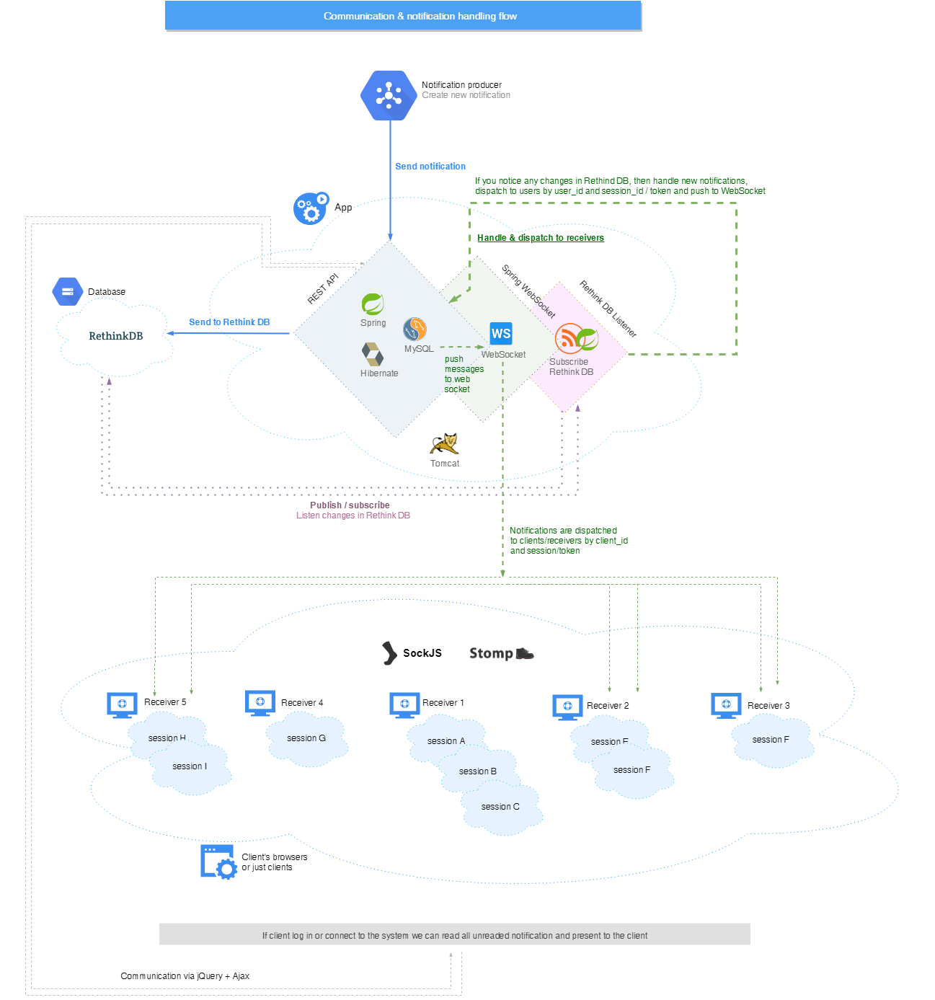
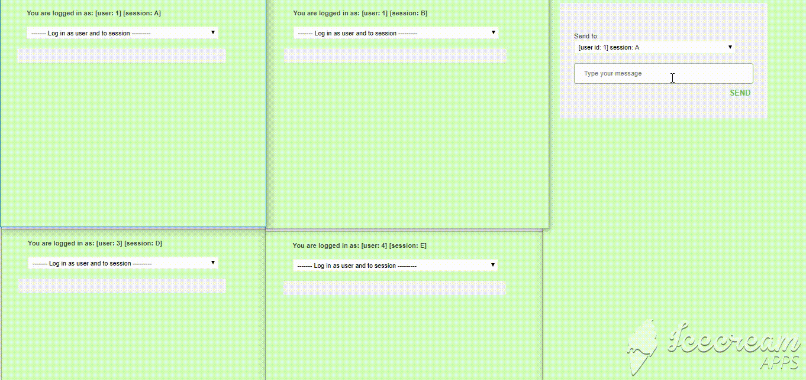

**Realtime notifications, realtime publisher**

---

## Overview

This is just an example project how can we publish and subscribe realtime notification to user and/or concrete sessions.

*Solution base on Spring + websocked + RethinkDB*

Inside:

* Spring Boot (https://spring.io/projects/spring-boot)

* Hibernate (http://hibernate.org/)

* SockJs (https://github.com/sockjs)

* Stomp (http://stomp.github.io/)

* Jackson (https://github.com/FasterXML/jackson-databind)

* Thymeleaf (https://www.thymeleaf.org/)

* MySql (https://www.mysql.com/)

* Rethink DB (https://www.rethinkdb.com/) [ alternatively you can use Kafka (https://kafka.apache.org/)]

* Flyway (https://flywaydb.org/)

## Communication flow

System has 2 layers. REST layer (Spring REST + MySQL) and the Socket Communication Layer to communicate with client and subscribe changes in RethinkDB.

---

## Testing on Docker

1. Build app image    

        realtime_notifer> mvn clean package docker:build

2. Go to /docker directory

        realtime_notifer> cd ./src/main/docker

3. Docker compose

        realtime_notifer/src/main/docker> docker-compose up

4. Check out client and sender HTML/JS example
    - http://HOST/client
    - http://HOST/sender
    
    HOST = *localhost:8090* or just container's host e.g. *http://192.168.99.100:8090*
    
5. Useful docker commands

        : go to cantainer and run bach
        docker exec -it realtime_notifer /bin/bash
        
        : stop all containers
        docker stop $(docker ps -a -q)
        
        : delete all containers
        docker rm $(docker ps -a -q)
        
        : delete all images 
        docker rmi $(docker images -q)
        
        : restart docker machine
        docker-machine restart default
        
        : get the IP address of machines
        docker-machine ip
        
*Test example:*

## Run without Docker
1. Update application.properties and set up your MySQL and RethinkDB credentials.
2. If you need some example data you can run Flyway Migration
    
        mvn flyway:migrate -Dflyway.configFile=src/main/resources/application.properties
    
3. Open a few clients and sender
4. Try to send any notification to any client

## See more

Apache Kafka example: https://www.baeldung.com/spring-kafka

Web sockets:  https://docs.spring.io/spring/docs/current/spring-framework-reference/web.html#websocket

Flyway migrations: https://flywaydb.org/

Docker: https://www.docker.com/

## Authors

* **Slawomir Hadas** - *author* - [Github](https://github.com/hadasbro)
